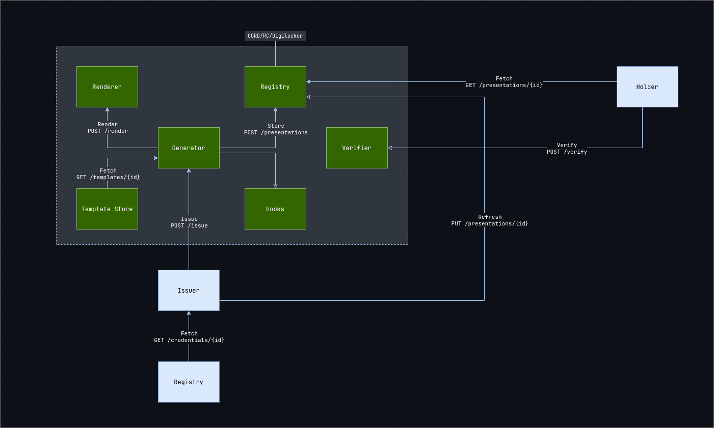

# Verifiable Presentation Generation Service Specification

> A plugin-based service that allows issuers to render verifiable presentations
> from templates, and store it in a queryable database for holders to
> list/retrieve.

## Terms and Definitions

### Defined by the [W3C VC Specification](https://www.w3.org/TR/vc-data-model)

- [Credential](https://www.w3.org/TR/vc-data-model/#dfn-credential)
- [Presentation](https://www.w3.org/TR/vc-data-model/#dfn-presentations)
- [Issuer](https://www.w3.org/TR/vc-data-model/#dfn-issuers)
- [Holder](https://www.w3.org/TR/vc-data-model/#dfn-holders)
- [Verifier](https://www.w3.org/TR/vc-data-model/#dfn-verifier)
- [Registry](https://www.w3.org/TR/vc-data-model/#dfn-verifiable-data-registries)

### Defined by this Specification

- Generator: A plugin-based service that is setup by, and allows, an issuer to
  generate a verifiable presentation from a template and store it in a queryable
  database for holders/clients to list, verify and retrieve.
- Renderer: A service that accepts data and a template and renders the
  presentation in the requested format.
- Template Store: A service that stores templates designed by the Issuer.

## Architecture



### Flow of Events

- Issuance of one or more verifiable credentials.
- Storage of verifiable credentials in a credential repository (such as a
  digital wallet).
- Composition and storage of verifiable presentation templates in a template
  store.
- Setting up of a generator by the issuer.
- Making a request to the generator set up in the previous step to generate a
  verifiable presentation.
- Verification of the verifiable presentation by the verifier.

## Template Store API

### **POST `/templates`**

> Store a new template in the store.

**Request Body**

| Field    | Type     | Required | Notes                                                         |
| -------- | -------- | -------- | ------------------------------------------------------------- |
| template | `string` | `true`   |                                                               |
| renderer | `enum`   | `true`   | Can be whatever the renderer supports, e.g., `ejs` or `jstl`. |
| schema   | `object` | `false`  | The AJV schema of the data required to render the template.   |

Example:

```json
{
	"template": "Hello ${data.name}",
	"renderer": "jstl",
	"schema": {
		"type": "object",
		"properties": {
			"name": { "type": "string" }
		},
		"required": ["name"],
		"additionalProperties": false
	}
}
```

**Response**

Example:

```json
{
	"meta": {
		"status": 201
	},
	"data": {
		"id": "did:web:issuer.app:templates:PTqVo635KbGZXZ4KzUJV86iBpixt",
		"template": "Hello ${data.name}",
		"renderer": "jstl",
		"schema": {
			"type": "object",
			"properties": {
				"name": { "type": "string" }
			},
			"required": ["name"],
			"additionalProperties": false
		}
	}
}
```

**Errors**

_Template-Renderer Mismatch_

```json
{
	"meta": {
		"status": 400
	},
	"error": {
		"code": "improper-payload",
		"message": "The template provided cannot be rendered using the specified renderer."
	}
}
```

_Missing/Invalid Payload_

```json
{
	"meta": {
		"status": 400
	},
	"error": {
		"code": "improper-payload",
		"message": "Invalid value provided for field `renderer`."
	}
}
```

### **GET `/templates/{id}`**

> Retrieve a template and its metadata from the store.

**Request Parameters**

| Field | Type     | Required | Notes                               |
| ----- | -------- | -------- | ----------------------------------- |
| id    | `string` | `true`   | The ID of the template to retrieve. |

**Response**

Example:

```json
{
	"meta": {
		"status": 200
	},
	"data": {
		"id": "did:web:issuer.app:templates:PTqVo635KbGZXZ4KzUJV86iBpixt",
		"template": "Hello ${data.name}",
		"renderer": "jstl",
		"schema": {
			"type": "object",
			"properties": {
				"name": { "type": "string" }
			},
			"required": ["name"],
			"additionalProperties": false
		}
	}
}
```

**Errors**

_Template Not Found_

```json
{
	"meta": {
		"status": 404
	},
	"error": {
		"code": "entity-not-found",
		"message": "A template with the specified ID does not exist."
	}
}
```

## Renderer API

### **POST `/render`**

> Render a certificate using the given data from a specified template.

**Request Body**

| Field    | Type     | Required | Notes                                                                                                               |
| -------- | -------- | -------- | ------------------------------------------------------------------------------------------------------------------- |
| template | `object` | `true`   | The template to use to render the data.                                                                             |
| data     | `object` | `true`   | The data to render.                                                                                                 |
| output   | `enum`   | `true`   | The format in which to output the presentation. Can be whatever the renderer supports, e.g., `htm`, `svg` or `pdf`. |

Example:

```json
{
	"template": {
		"template": "Hello ${data.name}",
		"renderer": "jstl",
		"schema": {
			"type": "object",
			"properties": {
				"name": { "type": "string" }
			},
			"required": ["name"],
			"additionalProperties": false
		}
	},
	"data": {
		"name": "Happy"
	},
	"output": "htm"
}
```

**Response**

Example:

```json
{
	"meta": {
		"status": 200
	},
	"data": "Hello Happy"
}
```

**Errors**

_Missing/Invalid Payload_

```json
{
	"meta": {
		"status": 400
	},
	"error": {
		"code": "improper-payload",
		"message": "Invalid value provided for field `output`."
	}
}
```

_Template Not Found_

```json
{
	"meta": {
		"status": 404
	},
	"error": {
		"code": "entity-not-found",
		"message": "A template with the specified ID does not exist."
	}
}
```

_Insufficient Data/Schema Mismatch_

```json
{
	"meta": {
		"status": 412
	},
	"error": {
		"code": "precondition-failed",
		"message": "The data provided was insufficient to render the presentation using the specified template."
	}
}
```

## Registry API

### **GET `/presentations`**

> Search for presentations related to a certain holder.

**Request Query Parameters**

| Field    | Type     | Required | Notes                                                          |
| -------- | -------- | -------- | -------------------------------------------------------------- |
| `holder` | `string` | `false`  | The ID of the holder of the presentations we wish to retrieve. |

Example:

```http
GET /presentations?holder=did:web:issuer.app:presentations:mTvrhQMMf6KBEJFItejG0tpohz5U
```

**Response**

```json
{
	"meta": {
		"status": 200
	},
	"data": [
		{
			"@context": ["https://www.w3.org/2018/credentials/v1"],
			"id": "did:web:issuer.app:presentations:mTvrhQMMf6KBEJFItejG0tpohz5U",
			"holder": "did:web:issuer.app:entities:tpohz5uFEJFIteq3jY7vaG4gROLb",
			"type": "VerifiablePresentation",
			"verifiableCredential": [
				{
					"@context": [
						"https://www.w3.org/2018/credentials/v1",
						"https://w3id.org/security/suites/ed25519-2020/v1",
						{ "name": "https://schema.org/name" }
					],
					"credentialSubject": { "name": "Happy" },
					"id": "did:example:F4RGIuxcKIjygFThqsXW9GX6HocV",
					"issuanceDate": "2010-01-01T19:23:24Z",
					"issuer": "did:web:issuer.app:entities:oLrLuxcK8nNupXoNsXW9G",
					"type": ["VerifiableCredential", "IdentityCredential"],
					"proof": {
						"type": "Ed25519Signature2020",
						"created": "2022-07-09T13:29:11Z",
						"verificationMethod": "did:web:issuer.app:keys:zF7T2UyK4dk0D1sJsHYuJ6gkmlhu",
						"proofPurpose": "assertionMethod",
						"proofValue": "z5weBQmFAUeq8JVyfW5JuET89aBiK1HquiHCLv8yPAjYG91ohSLmetaddVdrhbWj71jKXg795Bapt5ba3dqwfTqzs"
					}
				}
			],
			"proof": {
				"challenge": "kkJYgVOYMtwONOkVTqmagEN48sOj",
				"created": "2022-07-09T13:29:11Z",
				"proofPurpose": "authentication",
				"proofValue": "z5BLQRLQcnoy6d2ZeKmXaTSbt9nCawmAhoMPnbL2z1K54HZvkNHnAosbzzbqPHv8ijYPc1HPQveGek5HwJy4oi3cn",
				"type": "Ed25519Signature2020",
				"verificationMethod": "did:web:issuer.app:keys:zF7T2UyK4dk0D1sJsHYuJ6gkmlhu"
			}
		}
	]
}
```

### **POST `/presentations`**

> Store a presentation in the registry.

**Request Body**

```json
{
	"@context": ["https://www.w3.org/2018/credentials/v1"],
	"id": "did:web:issuer.app:presentations:mTvrhQMMf6KBEJFItejG0tpohz5U",
	"holder": "did:web:issuer.app:entities:tpohz5uFEJFIteq3jY7vaG4gROLb",
	"type": "VerifiablePresentation",
	"verifiableCredential": [
		{
			"@context": [
				"https://www.w3.org/2018/credentials/v1",
				"https://w3id.org/security/suites/ed25519-2020/v1",
				{ "name": "https://schema.org/name" }
			],
			"credentialSubject": { "name": "Happy" },
			"id": "did:example:F4RGIuxcKIjygFThqsXW9GX6HocV",
			"issuanceDate": "2010-01-01T19:23:24Z",
			"issuer": "did:web:issuer.app:entities:oLrLuxcK8nNupXoNsXW9G",
			"type": ["VerifiableCredential", "IdentityCredential"],
			"proof": {
				"type": "Ed25519Signature2020",
				"created": "2022-07-09T13:29:11Z",
				"verificationMethod": "did:web:issuer.app:keys:zF7T2UyK4dk0D1sJsHYuJ6gkmlhu",
				"proofPurpose": "assertionMethod",
				"proofValue": "z5weBQmFAUeq8JVyfW5JuET89aBiK1HquiHCLv8yPAjYG91ohSLmetaddVdrhbWj71jKXg795Bapt5ba3dqwfTqzs"
			}
		}
	],
	"proof": {
		"challenge": "kkJYgVOYMtwONOkVTqmagEN48sOj",
		"created": "2022-07-09T13:29:11Z",
		"proofPurpose": "authentication",
		"proofValue": "z5BLQRLQcnoy6d2ZeKmXaTSbt9nCawmAhoMPnbL2z1K54HZvkNHnAosbzzbqPHv8ijYPc1HPQveGek5HwJy4oi3cn",
		"type": "Ed25519Signature2020",
		"verificationMethod": "did:web:issuer.app:keys:zF7T2UyK4dk0D1sJsHYuJ6gkmlhu"
	}
}
```

**Response**

Example:

```json
{
	"meta": {
		"status": 201
	},
	"data": {
		{
			"@context": ["https://www.w3.org/2018/credentials/v1"],
			"id": "did:web:issuer.app:presentations:mTvrhQMMf6KBEJFItejG0tpohz5U",
			"holder": "did:web:issuer.app:entities:tpohz5uFEJFIteq3jY7vaG4gROLb",
			"type": "VerifiablePresentation",
			"verifiableCredential": [
				{
					"@context": [
						"https://www.w3.org/2018/credentials/v1",
						"https://w3id.org/security/suites/ed25519-2020/v1",
						{ "name": "https://schema.org/name" }
					],
					"credentialSubject": { "name": "Happy" },
					"id": "did:example:F4RGIuxcKIjygFThqsXW9GX6HocV",
					"issuanceDate": "2010-01-01T19:23:24Z",
					"issuer": "did:web:issuer.app:entities:oLrLuxcK8nNupXoNsXW9G",
					"type": [ "VerifiableCredential", "IdentityCredential" ],
					"proof": {
						"type": "Ed25519Signature2020",
						"created": "2022-07-09T13:29:11Z",
						"verificationMethod": "did:web:issuer.app:keys:zF7T2UyK4dk0D1sJsHYuJ6gkmlhu",
						"proofPurpose": "assertionMethod",
						"proofValue": "z5weBQmFAUeq8JVyfW5JuET89aBiK1HquiHCLv8yPAjYG91ohSLmetaddVdrhbWj71jKXg795Bapt5ba3dqwfTqzs"
					}
				}
			],
			"proof": {
					"challenge": "kkJYgVOYMtwONOkVTqmagEN48sOj",
					"created": "2022-07-09T13:29:11Z",
					"proofPurpose": "authentication",
					"proofValue": "z5BLQRLQcnoy6d2ZeKmXaTSbt9nCawmAhoMPnbL2z1K54HZvkNHnAosbzzbqPHv8ijYPc1HPQveGek5HwJy4oi3cn",
					"type": "Ed25519Signature2020",
					"verificationMethod": "did:web:issuer.app:keys:zF7T2UyK4dk0D1sJsHYuJ6gkmlhu"
			}
		}
	}
}
```

**Errors**

_Missing/Invalid Payload_

```json
{
	"meta": {
		"status": 400
	},
	"error": {
		"code": "improper-payload",
		"message": "Invalid verifiable presentation provided."
	}
}
```

### **GET `/presentations/{id}`**

> Retrive a presentation from the registry.

**Request Parameters**

| Field | Type     | Required | Notes                                 |
| ----- | -------- | -------- | ------------------------------------- |
| id    | `string` | `true`   | The ID of the presentation to revoke. |

**Response**

Example:

```json
{
	"meta": {
		"status": 200
	},
	"data": {
		"@context": ["https://www.w3.org/2018/credentials/v1"],
		"id": "did:web:issuer.app:presentations:mTvrhQMMf6KBEJFItejG0tpohz5U",
		"holder": "did:web:issuer.app:entities:tpohz5uFEJFIteq3jY7vaG4gROLb",
		"type": "VerifiablePresentation",
		"verifiableCredential": [
			{
				"@context": [
					"https://www.w3.org/2018/credentials/v1",
					"https://w3id.org/security/suites/ed25519-2020/v1",
					{ "name": "https://schema.org/name" }
				],
				"credentialSubject": { "name": "Happy" },
				"id": "did:example:F4RGIuxcKIjygFThqsXW9GX6HocV",
				"issuanceDate": "2010-01-01T19:23:24Z",
				"issuer": "did:web:issuer.app:entities:oLrLuxcK8nNupXoNsXW9G",
				"type": ["VerifiableCredential", "IdentityCredential"],
				"proof": {
					"type": "Ed25519Signature2020",
					"created": "2022-07-09T13:29:11Z",
					"verificationMethod": "did:web:issuer.app:keys:zF7T2UyK4dk0D1sJsHYuJ6gkmlhu",
					"proofPurpose": "assertionMethod",
					"proofValue": "z5weBQmFAUeq8JVyfW5JuET89aBiK1HquiHCLv8yPAjYG91ohSLmetaddVdrhbWj71jKXg795Bapt5ba3dqwfTqzs"
				}
			}
		],
		"proof": {
			"challenge": "kkJYgVOYMtwONOkVTqmagEN48sOj",
			"created": "2022-07-09T13:29:11Z",
			"proofPurpose": "authentication",
			"proofValue": "z5BLQRLQcnoy6d2ZeKmXaTSbt9nCawmAhoMPnbL2z1K54HZvkNHnAosbzzbqPHv8ijYPc1HPQveGek5HwJy4oi3cn",
			"type": "Ed25519Signature2020",
			"verificationMethod": "did:web:issuer.app:keys:zF7T2UyK4dk0D1sJsHYuJ6gkmlhu"
		}
	}
}
```

**Errors**

_Presentation Not Found_

```json
{
	"meta": {
		"status": 404
	},
	"error": {
		"code": "entity-not-found",
		"message": "A presentation with the specified ID does not exist."
	}
}
```

### **PUT `/presentations/{id}`**

> Update a presentation in the registry.

**Request Parameters**

| Field | Type     | Required | Notes                                 |
| ----- | -------- | -------- | ------------------------------------- |
| id    | `string` | `true`   | The ID of the presentation to revoke. |

**Request Body**

```json
{
	"@context": ["https://www.w3.org/2018/credentials/v1"],
	"id": "did:web:issuer.app:presentations:mTvrhQMMf6KBEJFItejG0tpohz5U",
	"holder": "did:web:issuer.app:entities:tpohz5uFEJFIteq3jY7vaG4gROLb",
	"type": "VerifiablePresentation",
	"verifiableCredential": [
		{
			"@context": [
				"https://www.w3.org/2018/credentials/v1",
				"https://w3id.org/security/suites/ed25519-2020/v1",
				{ "name": "https://schema.org/name" }
			],
			"credentialSubject": { "name": "Happy" },
			"id": "did:example:F4RGIuxcKIjygFThqsXW9GX6HocV",
			"issuanceDate": "2010-01-01T19:23:24Z",
			"issuer": "did:web:issuer.app:entities:oLrLuxcK8nNupXoNsXW9G",
			"type": ["VerifiableCredential", "IdentityCredential"],
			"proof": {
				"type": "Ed25519Signature2020",
				"created": "2022-07-09T13:29:11Z",
				"verificationMethod": "did:web:issuer.app:keys:zF7T2UyK4dk0D1sJsHYuJ6gkmlhu",
				"proofPurpose": "assertionMethod",
				"proofValue": "z5weBQmFAUeq8JVyfW5JuET89aBiK1HquiHCLv8yPAjYG91ohSLmetaddVdrhbWj71jKXg795Bapt5ba3dqwfTqzs"
			}
		}
	],
	"proof": {
		"challenge": "kkJYgVOYMtwONOkVTqmagEN48sOj",
		"created": "2022-07-09T13:29:11Z",
		"proofPurpose": "authentication",
		"proofValue": "z5BLQRLQcnoy6d2ZeKmXaTSbt9nCawmAhoMPnbL2z1K54HZvkNHnAosbzzbqPHv8ijYPc1HPQveGek5HwJy4oi3cn",
		"type": "Ed25519Signature2020",
		"verificationMethod": "did:web:issuer.app:keys:zF7T2UyK4dk0D1sJsHYuJ6gkmlhu"
	}
}
```

**Response**

Example:

```json
{
	"meta": {
		"status": 200
	},
	"data": {
		"@context": ["https://www.w3.org/2018/credentials/v1"],
		"id": "did:web:issuer.app:presentations:mTvrhQMMf6KBEJFItejG0tpohz5U",
		"holder": "did:web:issuer.app:entities:tpohz5uFEJFIteq3jY7vaG4gROLb",
		"type": "VerifiablePresentation",
		"verifiableCredential": [
			{
				"@context": [
					"https://www.w3.org/2018/credentials/v1",
					"https://w3id.org/security/suites/ed25519-2020/v1",
					{ "name": "https://schema.org/name" }
				],
				"credentialSubject": { "name": "Happy" },
				"id": "did:example:F4RGIuxcKIjygFThqsXW9GX6HocV",
				"issuanceDate": "2010-01-01T19:23:24Z",
				"issuer": "did:web:issuer.app:entities:oLrLuxcK8nNupXoNsXW9G",
				"type": ["VerifiableCredential", "IdentityCredential"],
				"proof": {
					"type": "Ed25519Signature2020",
					"created": "2022-07-09T13:29:11Z",
					"verificationMethod": "did:web:issuer.app:keys:zF7T2UyK4dk0D1sJsHYuJ6gkmlhu",
					"proofPurpose": "assertionMethod",
					"proofValue": "z5weBQmFAUeq8JVyfW5JuET89aBiK1HquiHCLv8yPAjYG91ohSLmetaddVdrhbWj71jKXg795Bapt5ba3dqwfTqzs"
				}
			}
		],
		"proof": {
			"challenge": "kkJYgVOYMtwONOkVTqmagEN48sOj",
			"created": "2022-07-09T13:29:11Z",
			"proofPurpose": "authentication",
			"proofValue": "z5BLQRLQcnoy6d2ZeKmXaTSbt9nCawmAhoMPnbL2z1K54HZvkNHnAosbzzbqPHv8ijYPc1HPQveGek5HwJy4oi3cn",
			"type": "Ed25519Signature2020",
			"verificationMethod": "did:web:issuer.app:keys:zF7T2UyK4dk0D1sJsHYuJ6gkmlhu"
		}
	}
}
```

**Errors**

_Missing/Invalid Payload_

```json
{
	"meta": {
		"status": 400
	},
	"error": {
		"code": "improper-payload",
		"message": "Invalid verifiable presentation provided."
	}
}
```

_Presentation Not Found_

```json
{
	"meta": {
		"status": 404
	},
	"error": {
		"code": "entity-not-found",
		"message": "A presentation with the specified ID does not exist."
	}
}
```

> **Note**
>
> There is no endpoint to delete/revoke presentations as they are automatically
> invalidated when the credentials they encapsulate are expired/revoked/deleted.

## Generator API

### **GET `/keys`**

> List the generated key pairs.

**Request Query Parameters**

| Field  | Type     | Required | Notes                |
| ------ | -------- | -------- | -------------------- |
| `name` | `string` | `false`  | The name of the key. |

Example:

```http
GET /keys?name=Example%20Key
```

**Response**

Example:

```json
{
	"meta": {
		"status": 200
	},
	"data": [
		{
			"id": "did:web:issuer.app:keys:oLrLoSxG8nNupXoNZD8fJ",
			"name": "Example Key",
			"type": "Ed25519VerificationKey2020",
			"created": "2022-06-28T04:29:59+05430",
			"public": "..."
		}
	]
}
```

### **POST `/keys`**

> Generate a new key pair used to sign verifiable presentations.

**Request Body**

| Field | Type     | Required | Notes                                                                                                                          |
| ----- | -------- | -------- | ------------------------------------------------------------------------------------------------------------------------------ |
| name  | `string` | `true`   | The name of the key.                                                                                                           |
| type  | `enum`   | `true`   | The type used to generate the key. Could be one of the following: `Ed25519VerificationKey2018` or `Ed25519VerificationKey2020` |

**Response**

Example:

```json
{
	"meta": {
		"status": 201
	},
	"data": [
		{
			"id": "did:web:issuer.app:keys:oLrLoSxG8nNupXoNZD8fJ",
			"name": "Example Key",
			"type": "Ed25519VerificationKey2020",
			"created": "2022-06-28T04:29:59+05430",
			"public": "..."
		}
	]
}
```

**Errors**

_Missing/Invalid Payload_

```json
{
	"meta": {
		"status": 400
	},
	"error": {
		"code": "improper-payload",
		"message": "Invalid value provided for field `type`."
	}
}
```

### **DELETE `/keys/{kid}`**

> Deletes a key pair that was used to sign verifiable presentations.

**Request Parameters**

| Field | Type     | Required | Notes                        |
| ----- | -------- | -------- | ---------------------------- |
| id    | `string` | `true`   | The ID of the key to delete. |

**Response**

Example:

```json
{
	"meta": {
		"status": 204
	}
}
```

**Errors**

_Key Not Found_

```json
{
	"meta": {
		"status": 404
	},
	"error": {
		"code": "entity-not-found",
		"message": "A key with the specified ID does not exist."
	}
}
```

_Key Is Used_

```json
{
	"meta": {
		"status": 412
	},
	"error": {
		"code": "precondition-failed",
		"message": "This key is already used by an application. Please unlink the key from the application before deleting it."
	}
}
```

### **POST `/applications`**

> Create an application to configure the generator. Each application uses a
> single template from a store to render presentations using a renderer service.
> The first key passed in the array will be used to sign all presentations by
> default.

**Request Body**

| Field    | Type            | Required | Notes                                             |
| -------- | --------------- | -------- | ------------------------------------------------- |
| name     | `string`        | `true`   | The name of the application.                      |
| template | `object`        | `true`   | The template store configuration.                 |
| renderer | `object`        | `true`   | The renderer configuration.                       |
| registry | `object`        | `true`   | The registry configuration.                       |
| keys     | `array<string>` | `true`   | The list of Key IDs to use to sign presentations. |

Example:

```json
{
	"name": "Happy Template Issuer",
	"template": {
		"id": "did:web:issuer.app:templates:PTqVo635KbGZXZ4KzUJV86iBpixt"
	},
	"renderer": {
		"api": "https://renderer.app"
	},
	"registry": {
		"api": "https://registry.app"
	},
	"keys": ["did:web:issuer.app:keys:oLrLoSxG8nNupXoNZD8fJ"]
}
```

**Response**

Example:

```json
{
	"meta": {
		"status": 201
	},
	"data": {
		"id": "did:web:issuer.app:applications:WSJ6ZiU3tWjllJjHuA9mm",
		"name": "Happy Template Issuer",
		"template": {
			"id": "did:web:issuer.app:templates:PTqVo635KbGZXZ4KzUJV86iBpixt"
		},
		"renderer": {
			"api": "https://renderer.app"
		},
		"registry": {
			"api": "https://registry.app"
		},
		"keys": ["did:web:issuer.app:keys:oLrLoSxG8nNupXoNZD8fJ"]
	}
}
```

**Errors**

_Invalid Server URI_

```json
{
	"meta": {
		"status": 400
	},
	"error": {
		"code": "improper-payload",
		"message": "The URI provided is not a valid template store."
	}
}
```

_Invalid Key ID_

```json
{
	"meta": {
		"status": 404
	},
	"error": {
		"code": "entity-not-found",
		"message": "A keypair with the specified ID was not found."
	}
}
```

_Missing/Invalid Payload_

```json
{
	"meta": {
		"status": 400
	},
	"error": {
		"code": "improper-payload",
		"message": "Invalid value provided for field `renderer.uri`."
	}
}
```

### **GET `/applications/{id}`**

> Retrieve the application metadata and configuration.

**Request Parameters**

| Field | Type     | Required | Notes                                  |
| ----- | -------- | -------- | -------------------------------------- |
| id    | `string` | `true`   | The ID of the application to retrieve. |

**Response**

Example:

```json
{
	"meta": {
		"status": 200
	},
	"data": {
		"id": "did:web:issuer.app:applications:WSJ6ZiU3tWjllJjHuA9mm",
		"name": "Happy Template Issuer",
		"template": {
			"id": "did:web:issuer.app:templates:PTqVo635KbGZXZ4KzUJV86iBpixt"
		},
		"renderer": {
			"api": "https://renderer.app"
		},
		"registry": {
			"api": "https://registry.app"
		},
		"keys": ["did:web:issuer.app:keys:oLrLoSxG8nNupXoNZD8fJ"]
	}
}
```

**Errors**

_Application Not Found_

```json
{
	"meta": {
		"status": 404
	},
	"error": {
		"code": "entity-not-found",
		"message": "An application with the specified ID does not exist."
	}
}
```

### **PATCH `/application/{id}`**

> Update an application's configuration.

**Request Body**

| Field    | Type     | Required | Notes                             |
| -------- | -------- | -------- | --------------------------------- |
| name     | `string` | `false`  | The name of the application.      |
| template | `object` | `true`   | The template store configuration. |
| renderer | `object` | `true`   | The renderer configuration.       |

Example:

```json
{
	"name": "Happy Template Issuing Application"
}
```

**Response**

Example:

```json
{
	"meta": {
		"status": 200
	},
	"data": {
		"id": "did:web:issuer.app:applications:WSJ6ZiU3tWjllJjHuA9mm",
		"name": "Happy Template Issuing Application",
		"template": {
			"id": "did:web:issuer.app:templates:PTqVo635KbGZXZ4KzUJV86iBpixt"
		},
		"renderer": {
			"api": "https://renderer.app"
		},
		"registry": {
			"api": "https://registry.app"
		},
		"keys": ["did:web:issuer.app:keys:oLrLoSxG8nNupXoNZD8fJ"]
	}
}
```

**Errors**

_Invalid Server URI_

```json
{
	"meta": {
		"status": 400
	},
	"error": {
		"code": "improper-payload",
		"message": "The URI provided is not a valid template store."
	}
}
```

_Missing/Invalid Payload_

```json
{
	"meta": {
		"status": 400
	},
	"error": {
		"code": "improper-payload",
		"message": "Invalid value provided for field `renderer.uri`."
	}
}
```

_Application Not Found_

```json
{
	"meta": {
		"status": 404
	},
	"error": {
		"code": "entity-not-found",
		"message": "An application with the specified ID does not exist."
	}
}
```

### **DELETE `/applications/{id}`**

> Delete an application.

**Request Parameters**

| Field | Type     | Required | Notes                                |
| ----- | -------- | -------- | ------------------------------------ |
| id    | `string` | `true`   | The ID of the application to delete. |

**Response**

Example:

```json
{
	"meta": {
		"status": 204
	}
}
```

**Errors**

_Application Not Found_

```json
{
	"meta": {
		"status": 404
	},
	"error": {
		"code": "entity-not-found",
		"message": "An application with the specified ID does not exist."
	}
}
```

#### **POST `/applications/{id}/issue`**

> Issue a new verifiable presentation. The data passed to the template is the
> contents of the `credentialSubject` field in all the credentials.

**Request Body**

| Field       | Type            | Required | Notes                                                                                                                      |
| ----------- | --------------- | -------- | -------------------------------------------------------------------------------------------------------------------------- |
| credentials | `array<object>` | `true`   | The credentials to use to create a presentation.                                                                           |
| output      | `enum`          | `true`   | The format in which the presentation should be rendered. Can be whatever the render supports, e.g., `htm`, `svg` or `pdf`. |
| holder      | `string`        | `true`   | The holder of the presentation.                                                                                            |

```json
{
	"credentials": [
		{
			"@context": [
				"https://www.w3.org/2018/credentials/v1",
				"https://w3id.org/security/suites/ed25519-2020/v1",
				{ "name": "https://schema.org/name" }
			],
			"credentialSubject": { "name": "Happy" },
			"id": "did:example:F4RGIuxcKIjygFThqsXW9GX6HocV",
			"issuanceDate": "2010-01-01T19:23:24Z",
			"issuer": "did:web:issuer.app:entities:oLrLuxcK8nNupXoNsXW9G",
			"type": ["VerifiableCredential", "IdentityCredential"],
			"proof": {
				"type": "Ed25519Signature2020",
				"created": "2022-07-09T13:29:11Z",
				"verificationMethod": "did:web:issuer.app:keys:zF7T2UyK4dk0D1sJsHYuJ6gkmlhu",
				"proofPurpose": "assertionMethod",
				"proofValue": "z5weBQmFAUeq8JVyfW5JuET89aBiK1HquiHCLv8yPAjYG91ohSLmetaddVdrhbWj71jKXg795Bapt5ba3dqwfTqzs"
			}
		}
	],
	"output": "svg",
	"holder": "did:web:issuer.app:entities:tpohz5uFEJFIteq3jY7vaG4gROLb"
}
```

**Response**

Example:

```json
{
	"meta": {
		"status": 201
	},
	"data": {
		"certificate": "<svg ...",
		"presentation": {
			"@context": ["https://www.w3.org/2018/credentials/v1"],
			"id": "did:web:issuer.app:presentations:mTvrhQMMf6KBEJFItejG0tpohz5U",
			"holder": "did:web:issuer.app:entities:tpohz5uFEJFIteq3jY7vaG4gROLb",
			"type": "VerifiablePresentation",
			"verifiableCredential": [
				{
					"@context": [
						"https://www.w3.org/2018/credentials/v1",
						"https://w3id.org/security/suites/ed25519-2020/v1",
						{ "name": "https://schema.org/name" }
					],
					"credentialSubject": { "name": "Happy" },
					"id": "did:example:F4RGIuxcKIjygFThqsXW9GX6HocV",
					"issuanceDate": "2010-01-01T19:23:24Z",
					"issuer": "did:web:issuer.app:entities:oLrLuxcK8nNupXoNsXW9G",
					"type": ["VerifiableCredential", "IdentityCredential"],
					"proof": {
						"type": "Ed25519Signature2020",
						"created": "2022-07-09T13:29:11Z",
						"verificationMethod": "did:web:issuer.app:keys:zF7T2UyK4dk0D1sJsHYuJ6gkmlhu",
						"proofPurpose": "assertionMethod",
						"proofValue": "z5weBQmFAUeq8JVyfW5JuET89aBiK1HquiHCLv8yPAjYG91ohSLmetaddVdrhbWj71jKXg795Bapt5ba3dqwfTqzs"
					}
				}
			],
			"proof": {
				"challenge": "kkJYgVOYMtwONOkVTqmagEN48sOj",
				"created": "2022-07-09T13:29:11Z",
				"proofPurpose": "authentication",
				"proofValue": "z5BLQRLQcnoy6d2ZeKmXaTSbt9nCawmAhoMPnbL2z1K54HZvkNHnAosbzzbqPHv8ijYPc1HPQveGek5HwJy4oi3cn",
				"type": "Ed25519Signature2020",
				"verificationMethod": "did:web:issuer.app:keys:zF7T2UyK4dk0D1sJsHYuJ6gkmlhu"
			}
		}
	}
}
```

**Errors**

_Missing/Invalid Payload_

```json
{
	"meta": {
		"status": 400
	},
	"error": {
		"code": "improper-payload",
		"message": "Invalid value provided for field `output`."
	}
}
```
